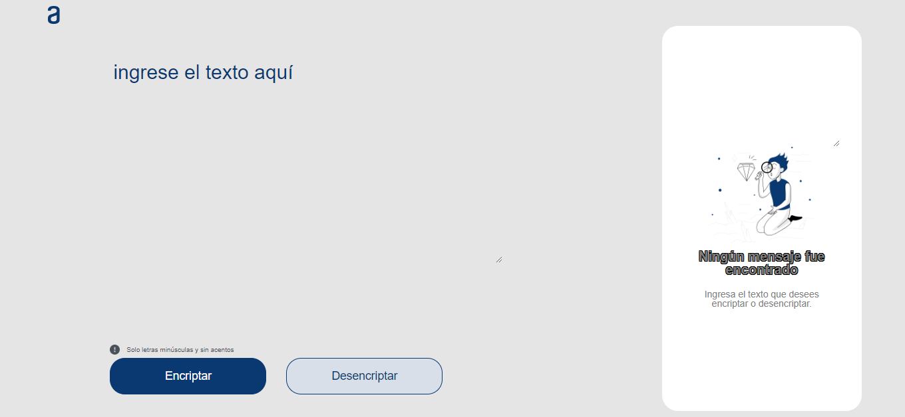
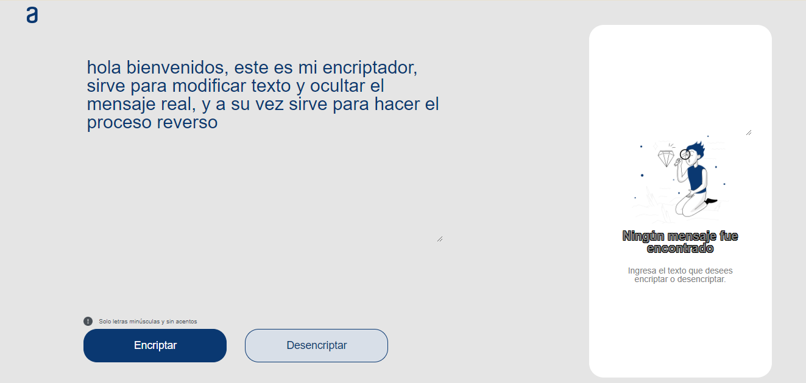
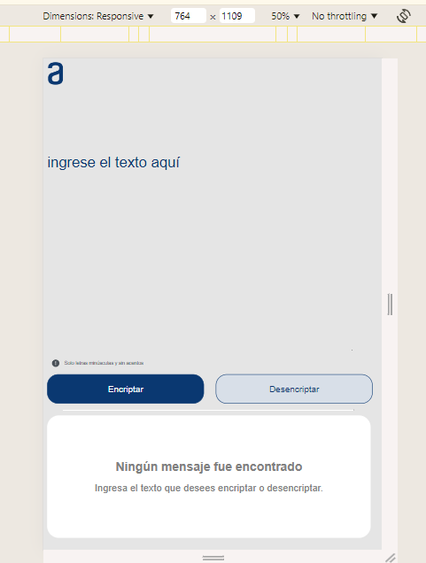
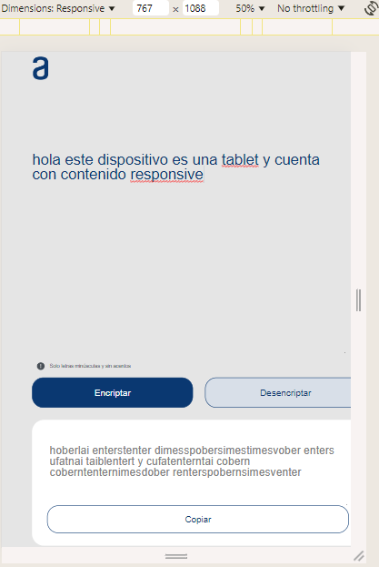
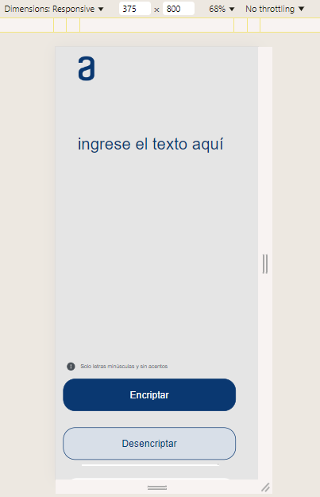
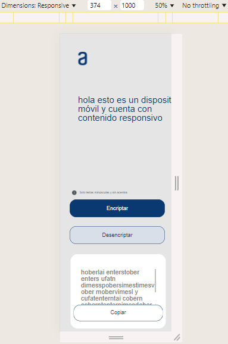

# Encriptador de Texto

Este es un proyecto de encriptador de texto desarrollado con HTML, CSS y JavaScript. La aplicación permite encriptar y desencriptar textos siguiendo una codificación específica. Además, cuenta con una interfaz sencilla y amigable, diseñada para ofrecer una experiencia de usuario óptima tanto en dispositivos de escritorio como en tablets y móviles.

## Características

- **Encriptación y Desencriptación:** Convierte texto utilizando una codificación específica y devuelve el texto original.
- **Interfaz Responsive:** La aplicación está optimizada para ser utilizada en diferentes tamaños de pantalla, incluyendo tablets y móviles.
- **Copiado al Portapapeles:** Permite copiar el texto encriptado o desencriptado al portapapeles con un solo clic.

## Estructura del Proyecto

El proyecto se organiza en los siguientes archivos y carpetas:

- `index.html`: Estructura básica de la aplicación.
- `styles.css`: Estilos de la aplicación, incluyendo media queries para responsive design.
- `script.js`: Lógica de encriptación, desencriptación y funcionalidad del botón de copiado.
- `imagenes/`: Carpeta que contiene las imágenes utilizadas en la interfaz (logo, iconos, etc.).

## Tecnologías Utilizadas

- **HTML5:** Para la estructura de la página.
- **CSS3:** Para el diseño y la presentación visual.
- **JavaScript:** Para la lógica de encriptación, desencriptación y otras funcionalidades interactivas.

## Funcionamiento

### Encriptación
El texto ingresado se convierte según las siguientes reglas:

- **e** se convierte en **enter**
- **i** se convierte en **imes**
- **a** se convierte en **ai**
- **o** se convierte en **ober**
- **u** se convierte en **ufat**

### Desencriptación
El proceso inverso se aplica para devolver el texto a su estado original.

## Ejemplos de Encriptación

| Original | Encriptado   |
|----------|--------------|
| hola     | hoberlai     |
| cielo    | cimeselober  |
| adios    | aidimesober  |

Como se puede observar, las vocales en el texto original son reemplazadas según las reglas establecidas, resultando en una versión encriptada que es ilegible a simple vista. Esto demuestra la efectividad del encriptador para ocultar el contenido original.

## Diseño Responsivo

El encriptador está diseñado para ser completamente responsivo, adaptándose a diferentes tamaños de pantalla para garantizar una experiencia de usuario óptima en tabletas y teléfonos móviles. Aquí están los detalles:

### En Dispositivos Tabletas

- **Diseño en Columnas**: La interfaz se organiza en columnas para adaptarse a la pantalla más amplia de las tabletas, asegurando que todos los elementos sean accesibles sin necesidad de hacer zoom.
- **Ajustes en el Tamaño de Botones**: Los botones de encriptar y desencriptar se ajustan para ocupar el espacio disponible de manera eficiente, facilitando su uso en pantallas más grandes.

### En Dispositivos Móviles

- **Diseño en Una Sola Columna**: En pantallas más pequeñas, el diseño se ajusta a una sola columna, lo que permite una fácil navegación y una visualización clara del contenido.
- **Botones Apilados**: Los botones se colocan uno debajo del otro para adaptarse al ancho reducido de los dispositivos móviles, mejorando la accesibilidad.
- **Ajustes en el Tamaño del Texto y Área de Entrada**: El tamaño del texto y las áreas de entrada se ajustan para que el contenido sea legible y fácil de interactuar en pantallas más pequeñas.

Estas características aseguran que el encriptador funcione de manera efectiva en una variedad de dispositivos, proporcionando una experiencia de usuario consistente y agradable.

## Agradecimiento

¡Gracias por tomarte el tiempo de revisar mi proyecto! Espero que encuentres útil y interesante lo que he creado. Si tienes alguna sugerencia o comentario, no dudes en contactarme. ¡Tu feedback es muy valioso para mí!

## Contacto

Brayan Andres jimenez Rodriguez, Ingeniero mecánico de la universidad Distrital Francisco Jose de Caldas, en Colombia

- [GitHub](https://github.com/BrayanAndresJ)
- [LinkedIn](https://www.linkedin.com/in/brayan-andres-jimenez-rodriguez-b0a2b5207/)
- [Hoja-de-vida](https://portafolio-actual-pi.vercel.app/)
